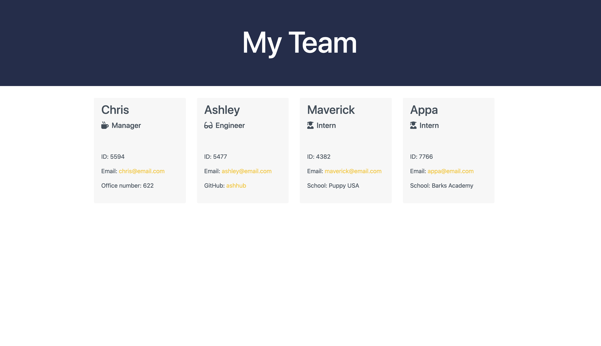
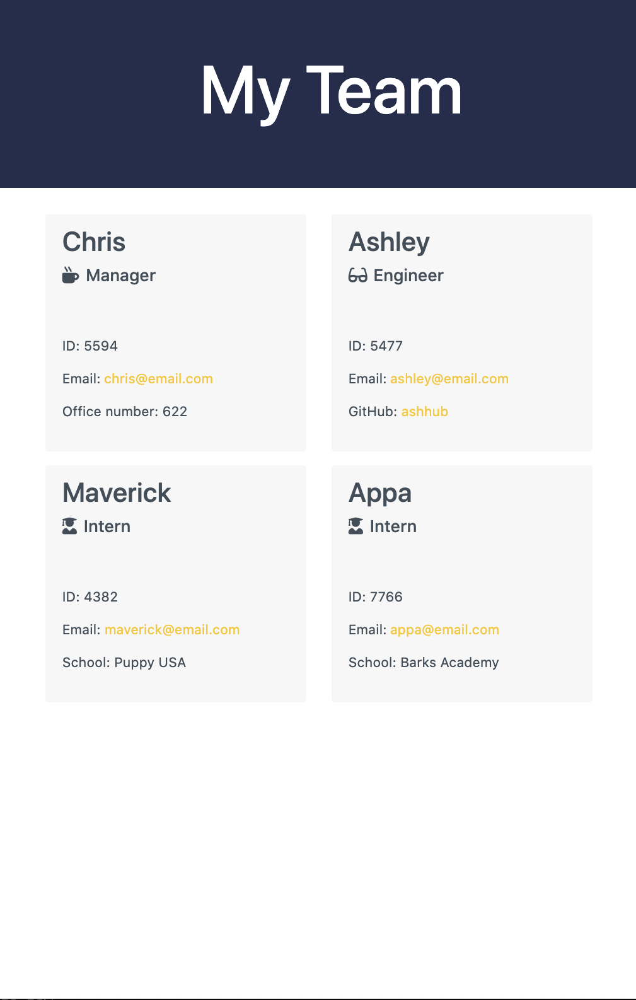
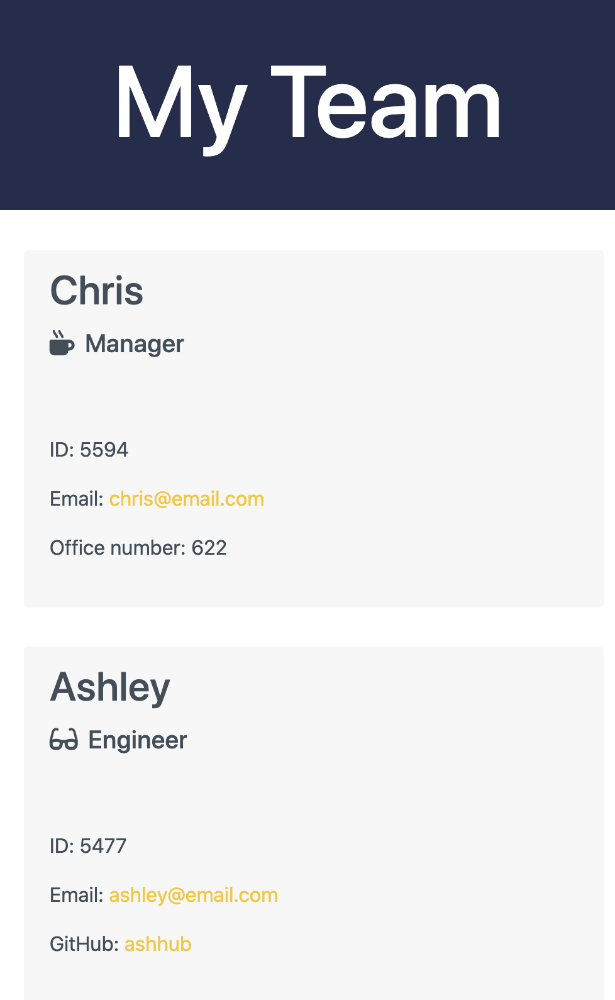

# Homework 10 Employee Summary

The challenge was to build a Node CLI that takes in information from the terminal about employees and then outputs an HTML webpage that will display all of the summaries of all employees entered. Not only do we have to display all summaries, all steps need to be tested to be sure all tests pass and app parts of the app work effectively.

One of the main goals was also to write code that is readable and easily maintainable. Having clean, readable and easy to scan code is as much apart of the design as the UX or UI of the application you are building.

<br>

## Previews

>[Watch The Video](https://drive.google.com/file/d/1BkkBG4wP7MNilpQi8_ILptr6n8qCEa_J/view?usp=sharing)

>[View the Page](https://ashhunt07.github.io/hw-10-employee-summary/output/team.html)



<br>

 &emsp; 


<br>

## The User Store

>As a manager
I want to generate a webpage that displays my team's basic info
so that I have quick access to emails and GitHub profiles
>>All employees must have: 
>> * name 
>> * id
>> * email
>>
>> In addition to adding: 
>> * Managers: Office Number
>> * Engineer: Git Hub Username
>> * Intern: School
> 
> All information must be organized, highly readable and easy to use across all devices.

<br>

## Requirements

* Use the Inquirer npm package to prompt the user for their email, id, and specific information based on their role with the company. Each role has a unique piece of information

* The app must run as a Node CLI to gather information about each employee.

<br>

## Getting Started

Clone this repo to your local machine. Once you have the files run the following commannd to install all dependancies.

```
Run npm install
```

The dependencies are, [jest](https://jestjs.io/) for running the provided tests, and [inquirer](https://www.npmjs.com/package/inquirer) for collecting input from the user.

<br>

## Test Instructions

Recommended workflow to follow:

1. Run tests
2. Create or update classes to pass a single test case
3. Repeat

Remember, you can run the tests at any time with 
```
npm run test
```
<br>

## Instructions

Once this is installed, you can run the following code to initiate the application:

```
node app.js
```

The application will start with a greeting and then propt you for information about your manger! Once the manager's information in complete you will be given the choice or adding and Engineer or an Intern to your team. This prompt will continue after each teammate is added until you choose the "Complete Team" options. 

Once your team is complete, an HTML file will be created with you entire teams information. 

This page is created to work on your mobile, tablet and desktop devices so you can view your team on at device at any time.

<br>


## Code Used


<br><br>


#### Contributor
##### Ashley Hunt
##### * [GitHub](https://github.com/ashhunt07)
##### * [Contact](https://ashhunt07.github.io/portfolio/contact.html)
